# E2E Test Isolation (NestJS + Prisma + Fastify)

Como isolar testes E2E **corretamente** nesta stack. Use quando for **escrever** novo `*.e2e-spec.ts` ou **debugar** falha intermitente / vazamento de estado.

## When to Use

Sintomas: "teste passa sozinho mas falha na suíte", "vê dados do teste anterior", "race condition entre testes", "tenant leak (usuário de empresa A aparece em empresa B)", "FastifyAdapter quebra no `app.init()`", `Error: connect ECONNREFUSED 5434`.

**Não** use para: testes unitários (use `nest-testing-patterns`).

## 5 Regras de Isolamento

```dot
digraph isolation {
  "1. cleanDatabase em beforeEach" [shape=box];
  "2. maxWorkers=1 (já configurado)" [shape=box];
  "3. Fastify: app.init() + ready()" [shape=box];
  "4. Criar fixtures dentro do it() (não no beforeAll)" [shape=box];
  "5. Multi-tenant: usar helpers com empresaId" [shape=box];
}
```



## Quick Reference — Setup E2E

```typescript
// test/<modulo>.e2e-spec.ts
import { Test, TestingModule } from '@nestjs/testing';
import { ValidationPipe } from '@nestjs/common';
import { FastifyAdapter, NestFastifyApplication } from '@nestjs/platform-fastify';
import request from 'supertest';
import { AppModule } from '../src/app.module';
import { PrismaService } from '../src/prisma/prisma.service';
import { cleanDatabase } from './e2e-utils';

let app: NestFastifyApplication;
let prisma: PrismaService;

beforeAll(async () => {
  const moduleRef = await Test.createTestingModule({ imports: [AppModule] }).compile();
  app = moduleRef.createNestApplication<NestFastifyApplication>(
    new FastifyAdapter({ logger: false }),
  );
  prisma = app.get(PrismaService);
  app.useGlobalPipes(new ValidationPipe({ whitelist: true, forbidNonWhitelisted: true, transform: true }));
  await app.init();
  await app.getHttpAdapter().getInstance().ready();   // ← OBRIGATÓRIO no Fastify
});

afterAll(async () => { await app.close(); });
beforeEach(async () => { await cleanDatabase(prisma); });   // ← não beforeAll
```

## Common Mistakes

| ❌ Errado | ✅ Certo |
|----------|---------|
| `cleanDatabase` em `beforeAll` | `beforeEach` (cada teste começa limpo) |
| Criar fixtures em `beforeAll` | Criar **dentro do `it()`** com helpers |
| `app.init()` sem `app.getHttpAdapter().getInstance().ready()` | sempre chamar `ready()` antes de `request()` |
| `supertest('http://localhost:3001')` | `request(app.getHttpServer())` (mais rápido, in-process) |
| Estado compartilhado entre `it()` (variável de módulo) | cada teste recria seus dados |
| `await prisma.user.deleteMany()` manual | `cleanDatabase(prisma)` (já lida com FKs e sequences) |
| Rodar `npm run test:e2e` sem `docker compose up -d postgres redis` | sempre subir infra antes |
| Esquecer `NODE_ENV=test` | já setado pelo script `npm run test:e2e` |
| Multi-tenant: criar usuário sem `empresaId` | sempre passar `x-empresa-id` no header |
| Test que depende de `id=1` | buscar o `id` após criar (PK pode ser 2, 3, ...) |

## Multi-tenant — fixture helper

```typescript
async function criarUsuarioComEmpresa(email = 'a@b.com') {
  const empresa = await request(app.getHttpServer())
    .post('/empresas').send({ nome: 'Emp Teste', cnpj: '00000000000100' });
  const empresaId = empresa.body.id;

  const user = await request(app.getHttpServer())
    .post('/usuarios')
    .set('x-empresa-id', empresaId)
    .send({ email, senha: 'Password123!' });
  return { empresaId, userId: user.body.id, accessToken: ... };
}

it('não deve vazar dados entre empresas', async () => {
  const a = await criarUsuarioComEmpresa('a@b.com');
  const b = await criarUsuarioComEmpresa('b@b.com');

  const resA = await request(app.getHttpServer())
    .get('/usuarios')
    .set('Authorization', `Bearer ${a.accessToken}`)
    .set('x-empresa-id', a.empresaId)
    .expect(200);

  expect(resA.body.data.every(u => u.empresaId === a.empresaId)).toBe(true);
  expect(resA.body.data).toHaveLength(1);
});
```

## Debug — falha intermitente

```text
Sintoma: passa sozinho, falha na suíte
  1. Confirme maxWorkers=1 em test/jest-e2e.json  ← já está
  2. Confirme cleanDatabase em beforeEach         ← obrigatório
  3. Procure variáveis de módulo (let foo = ...) partilhadas
  4. Procure fixtures criadas em beforeAll (vazam)

Sintoma: timeout no app.init()
  1. Postgres não está up: docker compose ps
  2. .env.test não aponta para porta certa (5434)
  3. Migration não aplicada: npm run test:migrate

Sintoma: 401 inesperado
  1. Header Authorization está sendo enviado?
  2. JWT_SECRET é o mesmo em .env e .env.test?
  3. x-empresa-id está no header?

Sintoma: dados "fantasma" de teste anterior
  1. cleanDatabase não está sendo chamado
  2. Teste está criando dados fora do helper (vazamento)
```

## Red Flags — STOP

- `beforeAll` chamando `cleanDatabase` → testes não estão isolados.
- Teste usa `expect(res.body[0].id).toBe(1)` → PK não é determinística, use o id retornado na criação.
- `setTimeout(500)` em teste E2E → race condition, use `await waitFor(...)` ou evento.
- `console.log` + `expect` na mesma linha sem `await` → asserção não roda.

## Setup pré-E2E (passo-a-passo)

```bash
docker compose up -d postgres redis
export $(cat .env.test | grep -v '^#' | xargs)
npm run test:migrate
npm run test:e2e
```

> **Setup completo**: ver [`.agent/workflows/test-e2e.md`](../../workflows/test-e2e.md).

## Reference

- E2E setup: [`.agent/workflows/test-e2e.md`](../../workflows/test-e2e.md)
- Padrões NestJS: [`.agent/skills/nest-testing-patterns/SKILL.md`](../nest-testing-patterns/SKILL.md)
- Debug: [`.agent/workflows/debug-test-failure.md`](../../workflows/debug-test-failure.md)
- Fonte canônica: [AGENTS.md §11](../../AGENTS.md#11-testing)
