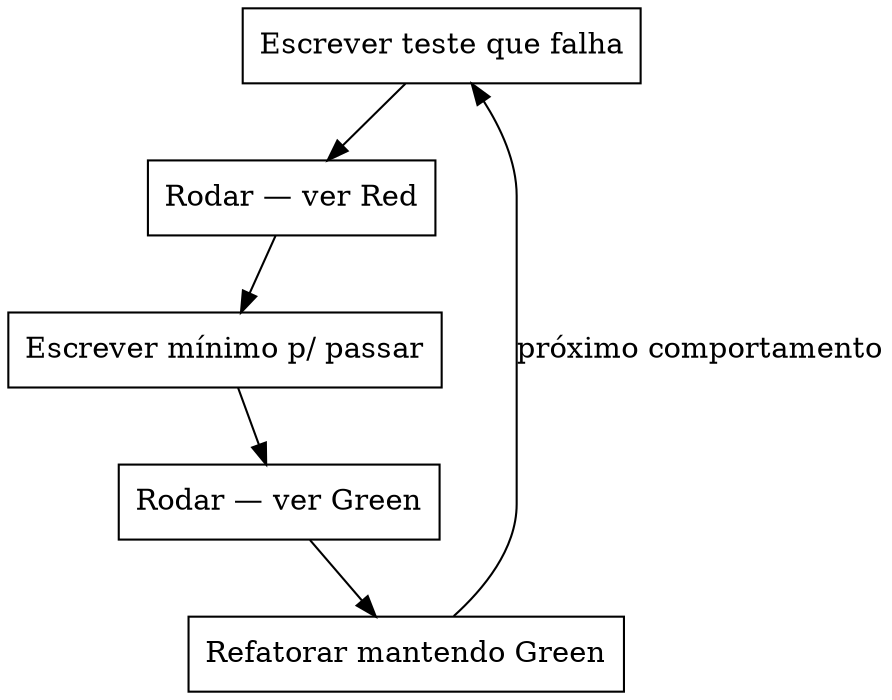

# TDD Red → Green → Refactor (NestJS)

Como aplicar o ciclo **Red → Green → Refactor** em código NestJS 11. Use quando for **escrever teste** de qualquer funcionalidade nova.

**Iron law**: NO PRODUCTION CODE WITHOUT A FAILING TEST FIRST. Não há exceção para "trivial", "config", "DTO". DTO é o **mais** importante de testar (é a porta de entrada).

## When to Use

Sintomas: "vou implementar e testar depois", "esse método é simples demais", "teste de DTO é overkill", "vou rodar o teste no final", ou está prestes a escrever código de produção sem `*.spec.ts` vermelho aberto.

**Não** use para: configurar Jest, debugar teste vermelho (use [`debug-test-failure`](../../workflows/debug-test-failure.md)), ou refatorar código já com cobertura.

## The Cycle



## Quick Reference — 5 passos por unidade

```text
1. Abrir <arquivo>.spec.ts (criar se não existir)
2. Escrever 1 it() para o PRÓXIMO comportamento, ANTES de o código existir
3. npm run test -- <caminho>  → ver Red (assertiva falhando)
4. Implementar o MÍNIMO para passar
5. npm run test -- <caminho>  → ver Green
6. Refatorar nome, extrair método, etc. (testes continuam verdes)
7. Repetir p/ próximo comportamento
```

## Exemplo — método `restore()` em UsuariosService

```typescript
// src/usuarios/application/services/usuarios.service.spec.ts
// PASSO 1+2: escreve o teste que vai falhar
describe('restore', () => {
  it('deve restaurar usuário setando ativo=true e deletedAt=null', async () => {
    mockRepo.findById.mockResolvedValue({ id: 1, ativo: false, deletedAt: new Date() });
    mockRepo.save.mockResolvedValue({ id: 1, ativo: true, deletedAt: null });
    const result = await service.restore(1);
    expect(result.ativo).toBe(true);
    expect(result.deletedAt).toBeNull();
  });
});

// PASSO 3: roda — Red (service.restore não existe)
// PASSO 4: implementa o mínimo em usuarios.service.ts
async restore(id: number): Promise<Usuario> {
  const user = await this.repo.findById(id);
  user.ativo = true;
  user.deletedAt = null;
  return this.repo.save(user);
}
// PASSO 5: roda — Green
// PASSO 6: refatora (extrai para BaseService se aplicável)
```

## Convenções deste projeto

| Item | Convenção |
|------|-----------|
| Nomes de teste | `deve [comportamento] quando [condição]` em pt-BR |
| Identifiers no código | inglês (classes, métodos, vars) |
| `describe` | agrupa por método ou rota |
| `beforeEach` | reseta mocks, recria módulo de teste |
| `afterEach` | `jest.clearAllMocks()` |
| Comentário no spec | `// BDD: features/...`, `// ATDD: ...`, `// TDD: ...` |
| Co-localização | spec fica **junto** do código (`*.spec.ts` ao lado de `*.ts`) |

## Rationalization Table

| Excuse | Reality |
|--------|---------|
| "Método é trivial demais" | Trivial quebra do mesmo jeito. Teste leva 30s. |
| "Já testei manualmente" | Manual = uma vez. CI = sempre. |
| "Teste depois atinge o mesmo objetivo" | Test-first = "o que deve fazer". Test-after = "o que faz". |
| "DTO não precisa de teste" | DTO é a **validação de entrada**. Sem teste, validação não existe. |
| "Vou cobrir tudo de uma vez no final" | Final = nunca. Cobertura é contínua. |
| "Esse é só um workaround" | Workaround vira feature. Teste já. |
| "O red é óbvio, vou pular para o green" | Pular o Red = saber o que **vai** quebrar, não o que **deveria** quebrar. |
| "Tá tudo relacionado, é um único teste" | Não está. Quebre em 2-3 `it()`. |
| "Já tenho e2e-spec" | E2e cobre fluxo, não branch. Unit cobre cada caminho. |

## Red Flags — STOP and Start Over

- Código de produção antes do teste correspondente.
- Teste que **passa de primeira** (Red não foi honesto).
- "Adaptar" o teste depois para o que o código faz (em vez de dizer o que **deveria** fazer).
- Múltiplos `it` no mesmo `expect` sem descrever o **porquê** de cada cenário.
- Test que só asserção de chamada (`toHaveBeenCalled`) sem verificar **argumentos**.
- "Vou rodar o teste no final" — você não vai.

## Common Mistakes

| ❌ Errado | ✅ Certo |
|----------|---------|
| `it('test login')` | `it('deve autenticar e retornar tokens quando credenciais válidas')` |
| `expect(result).toBeDefined()` | asserção sobre **comportamento** (valor, side-effect) |
| Mock do SUT | mock só de **dependências** |
| Hardcoded sleep | `waitFor` ou evento |
| 10 `mock.X.mockResolvedValue` em 1 teste | quebrar em 2-3 testes menores |
| Testar `if` privado | testar **efeito observável** |
| `expect(spy).toHaveBeenCalled()` sem args | `expect(spy).toHaveBeenCalledWith(expectedArgs)` |
| Refatorar junto com Green | **Refator só depois de Green** |
| Commitar com teste vermelho | corrigir antes de commitar |

## Reference

- Detalhes: [`.agent/docs/03-tdd-atdd-na-stack.md`](../../docs/03-tdd-atdd-na-stack.md)
- Estratégia: [`.agent/docs/01-estrategia-testes.md`](../../docs/01-estrategia-testes.md)
- Workflow pré-commit: [`.agent/workflows/alteracao-segura.md`](../../workflows/alteracao-segura.md)
- Workflow debug teste: [`.agent/workflows/debug-test-failure.md`](../../workflows/debug-test-failure.md)
