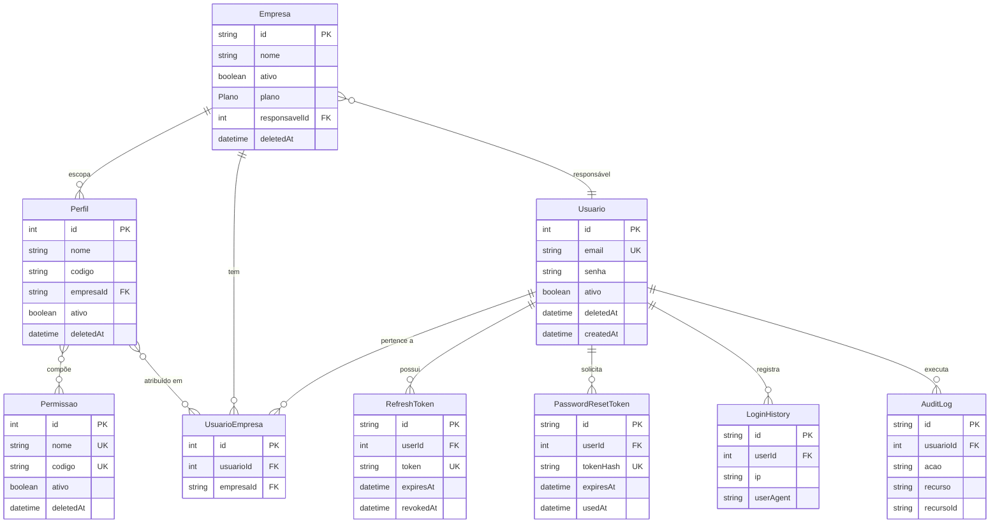

# AGENTS.md — Fonte de Verdade Única

> Este arquivo é a **fonte canônica de arquitetura, comandos, workflow e convenções** para todos os agentes (humanos ou IA) que operam neste repositório. Outros documentos (README, READMEs de módulo, workflows) referenciam este. Se algo aqui conflitar com outro doc, este vence.

## Índice

- [1. Visão Geral](#1-visão-geral)
- [2. Stack](#2-stack)
- [3. Setup e Comandos](#3-setup-e-comandos)
- [4. Arquitetura](#4-arquitetura)
- [5. Convenções](#5-convenções)
  - [5.1 Entidades ricas (DDD) — convenção de fábricas e transições](#51-entidades-ricas-ddd--convenção-de-fábricas-e-transições)
  - [5.2 Tipos compartilhados de domínio (JwtPayload, etc.)](#52-tipos-compartilhados-de-domínio-jwtpayload-etc)
  - [5.3 Segurança: CSP strict e Swagger em produção (BAI-002)](#53-segurança-csp-strict-e-swagger-em-produção-bai-002)
  - [5.4 `any` em produção — política](#54-any-em-produção--política)
- [6. Workflow de Desenvolvimento (DDD → BDD → SDD → ATDD → TDD)](#6-workflow-de-desenvolvimento-ddd--bdd--sdd--atdd--tdd)
- [7. Catálogo de Módulos](#7-catálogo-de-módulos)
- [8. Pré-commit e Validação de Alterações](#8-pré-commit-e-validação-de-alterações)
- [9. Infra e Observabilidade](#9-infra-e-observabilidade)
- [10. Variáveis de Ambiente](#10-variáveis-de-ambiente)
- [11. Testing](#11-testing)
- [12. Entry Points Úteis](#12-entry-points-úteis)
- [Apêndice A. Documentos do Repositório](#apêndice-a-documentos-do-repositório)

---

## 1. Visão Geral

API RESTful multi-tenant construída com **NestJS 11** sobre **Fastify**, **Prisma 6** + **PostgreSQL 16**, autenticação via **JWT/Passport**, rate-limit com **Throttler** (4 tiers), cache e filas com **Redis** + **BullMQ**, observabilidade via **OpenTelemetry → Jaeger**. Arquitetura em camadas (**Clean Architecture**) por módulo, com separação `domain` / `application` / `infrastructure` / `dto`. Veja a [visão pública e quickstart no README.md](./README.md) e o [guia de infra em src/shared/README_infra.md](./src/shared/README_infra.md).

## 2. Stack

- **Framework**: NestJS 11 (`@nestjs/core`, `@nestjs/common`, `@nestjs/platform-fastify`)
- **HTTP Server**: Fastify (`@nestjs/platform-fastify`)
- **ORM**: Prisma 6 (`@prisma/client`, `prisma`)
- **Banco**: PostgreSQL 16 (via Docker)
- **Cache/Filas**: Redis 7 + BullMQ + cache-manager-redis-yet
- **Auth**: JWT (`@nestjs/jwt`) + Passport.js + bcrypt
- **Rate Limit**: `@nestjs/throttler` com 4 tiers (short/medium/long/sensitive)
- **Validação**: `class-validator` + `class-transformer` + `Joi` (env)
- **Logging**: `nestjs-pino` (pino-http + pino-pretty em dev)
- **Segurança HTTP**: `@fastify/helmet`, CORS configurável
- **Documentação**: Swagger via `@nestjs/swagger` em `/swagger`
- **Observabilidade**: OpenTelemetry SDK + auto-instrumentations + Jaeger
- **Testes**: Jest + Supertest
- **Qualidade**: ESLint + Prettier + Husky + lint-staged

## 3. Setup e Comandos

### Pré-requisitos

- Node.js 20+
- Docker 20.10+ e **Docker Compose v2** (comando `docker compose` com espaço)

### Primeira execução

```bash
npm install
cp .env.example .env       # editar JWT_SECRET e demais
sudo usermod -aG docker $USER   # se ainda não estiver no grupo docker
docker compose up -d postgres redis
npx prisma migrate dev
npm run start:dev
```

API disponível em `http://localhost:3001`, Swagger em `http://localhost:3001/swagger`, Jaeger em `http://localhost:16686`.

### Comandos npm

```bash
# Dev
npm run start:dev          # nest --watch (porta 3001)
npm run start:debug        # com --inspect
npm run start:prod         # roda dist/main

# Testes
npm run test               # unitários (jest, rootDir: src, *.spec.ts)
npm run test -- path/para/arquivo.spec.ts               # 1 arquivo
npm run test -- -t "texto do describe ou it"            # filtro por nome
npm run test -- path/arquivo.spec.ts -t "caso"          # arquivo + filtro
npm run test:watch         # modo watch
npm run test:cov           # com cobertura
npm run test:e2e           # E2E (NODE_ENV=test, usa .env.test)
npm run test:migrate       # prisma migrate deploy (lê DATABASE_URL atual)

# Qualidade
npm run lint               # eslint --fix
npm run format             # prettier --write
npm run build              # nest build
npm run validate           # lint + build + test + test:e2e
npm run validate:quick     # lint + build + test  ← roda no pre-commit
npm run security:check     # npm audit --audit-level=high (bloqueia em high+)
npm run deps:check         # npm outdated
npm run deps:update        # npm update

# Prisma
npx prisma migrate dev --name <nome>     # nova migração em dev
npx prisma migrate deploy                # aplicar migrações (CI/prod)
npx prisma studio                        # GUI do banco
npx prisma generate                      # regenerar cliente
```

### Comandos Docker

```bash
docker compose up -d                      # stack completa (Postgres+pgAdmin+Jaeger+OTEL+Redis+API)
docker compose up -d postgres redis       # mínimo para dev local
docker compose -f docker-compose.dev.yml up -d   # stack de dev sem API nem Redis
docker compose down                       # parar tudo
docker compose down -v                    # parar e remover volumes (reset)
docker compose logs -f <serviço>          # acompanhar logs
docker compose ps                         # status
```

> **Permissão Docker (Linux)**: se receber `permission denied`, adicione seu usuário ao grupo `docker` (`sudo usermod -aG docker $USER`) e faça logout/login, ou use `newgrp docker` na sessão atual.

## 4. Arquitetura

### Estrutura de cada módulo

Cada módulo de negócio fica em `src/<modulo>/` e segue Clean Architecture:

```text
src/<modulo>/
├── domain/
│   ├── entities/          # classes de entidade com @Exclude() em campos sensíveis
│   └── repositories/      # apenas interfaces (tokens de DI)
├── application/
│   ├── controllers/       # HTTP: use @UsuarioLogado() e @EmpresaId(), nunca @Req()
│   └── services/          # casos de uso
├── infrastructure/
│   └── repositories/      # Prisma<Modulo>Repository implementa a interface do domain
├── dto/                   # DTOs com class-validator
└── <modulo>.module.ts
```

### Multi-tenancy (escopo central da aplicação)

Autorização é contextual por `Empresa`. Endpoints protegidos exigem **ambos** os headers:

- `Authorization: Bearer <jwt>`
- `x-empresa-id: <uuid>`

Fluxo: `EmpresaInterceptor` → `EmpresaContext` (provider request-scoped) → `@EmpresaId()` no controller → `PermissaoGuard` valida os `perfis` do usuário especificamente naquele `empresaId`.

> **Pontos-chave**:
>
> - **Perfis são escopados por empresa** (não globais). O mesmo nome de perfil pode existir em empresas diferentes com permissões diferentes.
> - **Permissões são globais** (representam ações do código, ex.: `READ_USUARIOS`).
> - O JWT carrega o `sub` (id do usuário) e a lista de empresas+perfis do usuário.

### Diagrama Entidade-Relacionamento (ER)

O modelo de dados completo, derivado de [`prisma/schema.prisma`](./prisma/schema.prisma):



> **Notas**:
>
> - `Usuario` é a raiz de identidade e o pivô das tabelas transversais (`RefreshToken`, `PasswordResetToken`, `LoginHistory`, `AuditLog`).
> - `UsuarioEmpresa` é a tabela de junção que materializa o vínculo N:M entre usuários e empresas, e carrega a atribuição de perfis (também N:M com `Perfil`).
> - `Perfil` é escopado por `Empresa` (FK obrigatória); `Permissao` é global.

### Soft delete

Todas as entidades persistentes estendem `BaseEntity` com `id`, `createdAt`, `updatedAt`, `deletedAt`, `ativo`. **Deletes são sempre lógicos** — setar `deletedAt` e `ativo=false`. `PrismaService` ([src/prisma/prisma.service.ts](./src/prisma/prisma.service.ts)) é estendido com um query extension que **auto-filtra `deletedAt: null`** — repositórios não precisam lembrar de adicionar a cláusula. Restore via PATCH limpando `deletedAt` e setando `ativo=true`.

### Modelos de dados transversais (não-business)

Tabelas que existem no [prisma/schema.prisma](./prisma/schema.prisma) mas que **não** representam entidades de negócio:

- **`AuditLog`** — registro imutável de ações marcadas com `@Auditar({...})` no controller. Campos: `id`, `usuarioId`, `acao`, `recurso`, `recursoId`, `detalhes (Json)`, `ip`, `userAgent`, `createdAt`. **Sem soft-delete** (append-only). Sem retenção automática — considere job de cleanup em releases futuros. Persistido pelo [src/shared/infrastructure/interceptors/audit.interceptor.ts](./src/shared/infrastructure/interceptors/audit.interceptor.ts).
- **`LoginHistory`** — histórico de logins bem-sucedidos e falhas. Campos: `id`, `userId`, `ip`, `userAgent`, `createdAt`. Sem retenção definida. Útil para auditoria e detecção de anomalias.
- **`RefreshToken`** — refresh tokens ativos (rotação habilitada). Campos: `id`, `token (unique)`, `userId`, `expiresAt`, `revokedAt`, `createdAt`. Ao usar `/auth/refresh`, o token é revogado (`revokedAt` setado) e um novo é emitido. Reuso de token revogado → invalida toda a cadeia (suspeita de roubo).

### Guards globais (registrados em `src/app.module.ts`)

Ordem de execução: `ThrottlerGuard` → `AuthGuard` → `PermissaoGuard`.

- `ThrottlerGuard` — rate limit, 4 tiers (ver seção 10).
- `AuthGuard` ([src/auth/application/guards/auth.guard.ts](./src/auth/application/guards/auth.guard.ts)) — JWT em todas as rotas por padrão; rotas públicas marcam com `@Public()`.
- `PermissaoGuard` ([src/auth/application/guards/permissao.guard.ts](./src/auth/application/guards/permissao.guard.ts)) — valida `@TemPermissao('...')` no contexto da `x-empresa-id`.

### Interceptors globais

- `ClassSerializerInterceptor` — aplica `@Exclude()` das entidades automaticamente.
- `LoggingInterceptor` — log de método/URL/status/latência.
- `EmpresaInterceptor` — popula `EmpresaContext` com base no header `x-empresa-id`.
- `AuditInterceptor` — auditoria de ações marcadas com `@Audit('ação')`.

### Filter global

- `AllExceptionsFilter` ([src/shared/infrastructure/filters/all-exceptions.filter.ts](./src/shared/infrastructure/filters/all-exceptions.filter.ts)) — formato padrão de erro: `{ statusCode, timestamp, path, message }`.

### Decorators customizados (use estes, não `@Req()`)

- `@Public()` — `auth/application/decorators/public.decorator.ts`. Marca rota como pública (bypassa `AuthGuard`).
- `@TemPermissao('CODE_1', ...)` — `auth/application/decorators/temPermissao.decorator.ts`. Exige permissões específicas.
- `@UsuarioLogado()` — `shared/application/decorators/usuario-logado.decorator.ts`. Injeta o `JwtPayload` no parâmetro.
- `@EmpresaId()` — `shared/application/decorators/empresa-id.decorator.ts`. Injeta o UUID da empresa do header `x-empresa-id`.
- `@Audit('ação')` — `shared/application/decorators/audit.decorator.ts`. Marca ação para `AuditInterceptor`.

## 5. Convenções

- **Idioma**: **português (pt-BR)** para comentários de código, descrições Swagger, Gherkin, docs de tarefa e commits. Identifiers e descrições de API podem ficar em inglês.
- **Segurança de dados**: **nunca** delete campos sensíveis manualmente nos services (`delete user.password`). Use `@Exclude()` na entidade e confie no `ClassSerializerInterceptor` global.
- **Paginação**: todos os endpoints de listagem **devem** usar `PaginationDto` (default `page=1`, `limit=10`) e retornar `PaginatedResponseDto<T>` (campos: `data`, `total`, `page`, `limit`, `totalPages`).
- **Swagger**: anote endpoints novos/alterados com `@ApiTags`, `@ApiOperation`, `@ApiResponse`, `@ApiBearerAuth` etc. OpenAPI em `/swagger` (somente fora de produção — ver §5.2).
- **Logging**: use o `Logger` de `@nestjs/common` (ou o de `nestjs-pino`) dentro de services. `LoggingInterceptor` cuida do HTTP.
- **Validação**: `ValidationPipe` global está configurado com `whitelist: true` e `forbidNonWhitelisted: true` — DTOs novos só precisam de `class-validator`.
- **Cobertura mínima de testes**: **statements, branches, functions e lines >= 80%** (enforçado por `coverageThreshold` em [package.json](./package.json) → bloco `jest`). `npm run test:cov` falha o build se qualquer métrica ficar abaixo. Novas features devem incluir testes unitários para caminhos felizes e para os branches de erro (NotFound, Conflict, Forbidden, P2002/P2025 do Prisma, validação de DTOs).
- **Qualidade**: SOLID, Clean Code. **Sem warnings, sem regras de lint desabilitadas sem justificativa**. Husky roda `validate:quick` em arquivos staged via lint-staged.
- **Config**: variáveis validadas por Joi em [src/config/env.validation.ts](./src/config/env.validation.ts). Defaults vêm de lá — não hardcode em services.
- **Documentação**: ao mudar contratos de API ou arquitetura, atualize `README.md`, `AGENTS.md` e o `README.md` do módulo afetado.

### 5.1 Entidades ricas (DDD) — convenção de fábricas e transições

Desde a Sprint 3 ([MED-003]), as 4 entidades de domínio centrais usam o
padrão de **Aggregate Root com fábrica estática + métodos de transição**:

```typescript
// src/<modulo>/domain/entities/<entidade>.entity.ts
export class Entidade extends BaseEntity {
  static criar(props: { ... }): Entidade {
    // valida invariantes, normaliza, gera id/timestamps
  }
  desativar(): void { /* soft delete idempotente */ }
  restaurar(): void { /* lança se não estava desativado */ }
  atualizarMetadados(props: { ... }): void { /* editáveis; resto é imutável */ }
  // métodos de domínio específicos do agregado
}
```

**Regras:**

1. **Fábrica `criar()` é a porta de entrada** para novas instâncias.
   Valida invariantes (ex: `email` regex em `Usuario`, `codigo`
   UPPER_SNAKE_CASE em `Perfil`/`Permissao`, `empresaId` obrigatório
   em `Perfil`), normaliza (lowercase, trim, upper), e gera `id` +
   timestamps. O repositório preenche `id` numérico se ausente.
2. **Construtor `Object.assign(this, partial)` permanece** para
   reidratação do DB (Prisma → entity). O uso de `criar()` é
   **mandatório** no service/handler ao construir uma nova instância.
3. **Transições (`desativar`, `restaurar`, `atualizarMetadados`,
   `transferirResponsabilidade`, `trocarPlano`, etc.)** ficam na
   entity — o service **delega** para elas. Não mutar campos
   `ativo`/`deletedAt` diretamente no service.
4. **Imutabilidade de identificadores de domínio**: `codigo` em
   `Perfil`/`Permissao`, `empresaId` em `Perfil` e `id` em geral
   **não** mudam após `criar()`. Para alterar, criar nova instância.
5. **Cobertura de testes**: cada `criar()` + cada transição + cada
   validação de invariante tem `it()` no spec. Aproximadamente
   +15 testes novos por entidade (Sprint 3: +59 totais).
6. **Spec helpers**: quando o spec constrói entidades via mock,
   use **factories de domínio** (helpers locais `make*()`) em vez
   de `const mock: T = { ... }` para evitar acoplar o teste a
   campos/métodos. Exemplo em
   [src/auth/application/services/auth.service.spec.ts:27-55](./src/auth/application/services/auth.service.spec.ts).

### 5.2 Tipos compartilhados de domínio (JwtPayload, etc.)

Para tipos que são **compartilhados entre camadas** (AuthService,
JwtStrategy, PermissaoGuard, controllers), criar arquivo dedicado em
`src/<modulo>/domain/types/<nome>.ts` (interface pura, sem classe
NestJS):

```typescript
// src/auth/domain/types/jwt-payload.ts
export interface EmpresaJwtPayload {
  id: string;            // UUID
  perfis?: PerfilJwtPayload[];
}
export interface JwtAccessTokenPayload {
  sub: number;
  email: string;
  empresas: EmpresaJwtPayload[];
  // ...
}
```

**Quando usar `domain/types/` vs `domain/types/` no module:**

- `domain/types/<X>.ts` — tipos **puros de domínio** (sem decoradores
  NestJS), compartilhados por ≥ 2 camadas do mesmo módulo.
- Tipos usados em **uma única camada** ficam no próprio arquivo
  (ex: DTOs em `application/dtos/`).

Exemplos em produção:
[src/auth/domain/types/jwt-payload.ts](./src/auth/domain/types/jwt-payload.ts)
(JwtAccessTokenPayload, EmpresaJwtPayload, PerfilJwtPayload,
PermissaoJwtPayload).

### 5.3 Segurança: CSP strict e Swagger em produção ([BAI-002])

[src/main.ts](./src/main.ts) registra `helmet` com diretiva CSP
**condicional ao `NODE_ENV`**:

- **Produção**: CSP estrita — `default-src 'self'`, `script-src 'self'`
  (sem `'unsafe-inline'`), `object-src 'none'`, `frame-ancestors 'none'`,
  `upgrade-insecure-requests`. **Swagger UI desabilitado** (o bundle
  React dele injeta `<script>` inline, incompatível com a CSP).
- **Dev/test**: CSP permissiva com `'unsafe-inline'` em `script-src` e
  `style-src` para que o Swagger UI funcione sem complicar com nonce.

O JSON do OpenAPI também é ocultado em prod — quem precisa do contrato
lê o arquivo versionado no repositório. Health-check (`/health`) e a
API em si continuam expostos; só a documentação interativa some.

### 5.4 `any` em produção — política

A regra `@typescript-eslint/no-explicit-any` está **off** no
[eslint.config.mjs](./eslint.config.mjs). Permitido, mas com
**auditoria obrigatória**:

1. **Preferir `unknown`** (com narrowing) sobre `any`.
2. **`any` justificado**: API do Prisma Client extensions
   ([src/prisma/prisma-extension.ts](./src/prisma/prisma-extension.ts))
   — a tipagem é intrinsecamente `any` por design (modelo/operação
   gerados dinamicamente). Cada `any` tem `// eslint-disable-next-line
   @typescript-eslint/no-explicit-any` com motivo em linha.
3. **`any` injustificado é regressão** — abrir finding MÉDIO.

## 6. Workflow de Desenvolvimento (DDD → BDD → SDD → ATDD → TDD)

**Ordem obrigatória. Nunca escreva código de produção antes de completar todas as etapas anteriores.**

1. **DDD** (Plan) — modelar agregados, entidades, value objects, repositórios. Artefato: esqueleto em `src/<modulo>/domain/`, update no AGENTS.md.
2. **BDD** (Plan) — escrever cenários Gherkin (happy path + exceções). Artefato: `features/<modulo>.feature`.
3. **SDD** (Plan) — spec formal com requisitos RFC 2119. Artefato: `.openspec/changes/<feature>/{proposal,design,tasks}.md`.
4. **ATDD** (Plan) — testes de aceitação que **falham** inicialmente. Artefato: `test/*.e2e-spec.ts` ou `*.acceptance.spec.ts`.
5. **TDD red** (Plan/Build) — testes unitários por cenário, que **falham**. Artefato: `src/**/*.spec.ts`.
6. **Implementação** (Build) — implementar o mínimo para os testes passarem (green). Artefato: código de produção.
7. **Refactor** (Build) — refatorar mantendo testes verdes. Artefato: código refatorado.
8. **ATDD verify** (Build) — rodar aceitação — devem passar. Artefato: relatório.
9. **SDD verify** (Build) — validar conformidade com `design.md`. Artefato: compliance report.
10. **Archive** (Build) — mover de `changes/<feature>/` para `specs/<feature>/`. Artefato: `.openspec/specs/` atualizado.

- **Plan Mode**: DDD, BDD, SDD, ATDD, TDD (escrita de testes). **Read-only — sem código de produção.**
- **Build Mode**: implementação, refactor, execução de testes.

Guias detalhados em [`.agent/workflows/sdd-workflow.md`](./.agent/workflows/sdd-workflow.md) (pipeline SDD+ATDD de 7 etapas) e [`.openspec/AGENTS.md`](./.openspec/AGENTS.md) (regras OpenSpec, RFC 2119, formato de spec).

### Rastreabilidade (comentários no código)

Cada arquivo de produção deve linkar seus artefatos:

```typescript
// BDD: features/discount.feature:Cenário: Cliente premium
// SDD: .openspec/changes/discount/design.md:REQ-DISC-01
// ATDD: test/discount.e2e-spec.ts
// TDD: src/discount/application/services/discount.service.spec.ts
function calculateDiscount(price: Money, userType: UserType): Discount { ... }
```

## 7. Catálogo de Módulos

```text
AppModule
├── AuthModule         → depende de UsuariosModule
├── UsuariosModule     ↔ EmpresasModule (forwardRef, dependência circular)
├── EmpresasModule     → UsuariosModule, PerfisModule
├── PerfisModule       → PermissoesModule
├── PermissoesModule   → AuthModule
├── PrismaModule       (global, sem deps)
├── HealthController   (Terminus, em src/shared/infrastructure/health/)
├── SharedModule       (decorators, filters, interceptors, config, health)
└── ThrottlerModule    (global)
```

- `auth` — [src/auth/](./src/auth/): JWT, AuthGuard, PermissaoGuard, strategies, decorators de auth. [README](./src/auth/README.md).
- `usuarios` — [src/usuarios/](./src/usuarios/): CRUD de usuários, soft delete/restore, vínculo usuário↔empresa. [README](./src/usuarios/README.md).
- `empresas` — [src/empresas/](./src/empresas/): CRUD de empresas, vínculo de usuários com perfis, escopo multi-tenant. [README](./src/empresas/README.md).
- `perfis` — [src/perfis/](./src/perfis/): Perfis escopados por empresa, atribuição de permissões. [README](./src/perfis/README.md).
- `permissoes` — [src/permissoes/](./src/permissoes/): Permissões atômicas globais (READ_*, CREATE_*, etc.). [README](./src/permissoes/README.md).
- `prisma` — [src/prisma/](./src/prisma/): PrismaService + extensão de soft delete.
- `shared` — [src/shared/](./src/shared/): Decorators, filters, interceptors, services, config, DTOs, health. [README](./src/shared/README.md) · [Infra](./src/shared/README_infra.md).

**Endpoints de saúde** (em `src/shared/infrastructure/health/`):

- `GET /health/live` — liveness (memória heap ≤ 150MB)
- `GET /health/ready` — readiness (DB + disco)
- `GET /health/network` — conectividade externa

## 8. Pré-commit e Validação de Alterações

O hook do Husky ([.husky/pre-commit](./.husky/pre-commit)) roda `npm run validate:quick` em arquivos staged via lint-staged (configurado em `package.json`):

```json
"lint-staged": {
  "*.{ts,tsx}": [
    "eslint --fix",
    "jest --findRelatedTests --passWithNoTests"
  ]
}
```

**Dois ciclos, propósitos diferentes** — não confunda:

- **Ciclo rápido (durante o desenvolvimento)**: [`.agent/workflows/verificacao-alteracao.md`](./.agent/workflows/verificacao-alteracao.md). Roda `validate:quick` + `security:check` + `deps:check` (sem E2E, sem commit). Use a cada iteração.
- **Ciclo pré-commit completo (antes de commit/PR)**: [`.agent/workflows/alteracao-segura.md`](./.agent/workflows/alteracao-segura.md). Inclui E2E, build, commit e push. Use para fechar o trabalho.

**Resumo do ciclo pré-commit completo**:

1. `npm run security:check` — bloqueia em vulnerabilidade `high`+
2. `npm run deps:check` — identifica desatualizações
3. `npm run lint` + `npm run format` — corrige estilo
4. `npm run test` — testes unitários
5. `npm run test:cov` — verifica cobertura (>= 80% em todas as métricas)
6. `npm run test:migrate` + `npm run test:e2e` — E2E (requer `docker compose up -d postgres redis`)
7. `npm run build` — valida compilação
8. Commit + push (ver [`.agent/workflows/abrir-pr.md`](./.agent/workflows/abrir-pr.md) para PRs)

Se qualquer passo falhar, corrija e reinicie a partir do passo 1. **Só faça commit após uma rodada completa sem alterações.**

> Workflows correlatos:
>
> - Migração Prisma: [`.agent/workflows/criar-migration.md`](./.agent/workflows/criar-migration.md)
> - Debug de teste que falha: [`.agent/workflows/debug-test-failure.md`](./.agent/workflows/debug-test-failure.md)
> - Pipeline SDD+ATDD: [`.agent/workflows/sdd-workflow.md`](./.agent/workflows/sdd-workflow.md)

## 9. Infra e Observabilidade

Detalhamento em [src/shared/README_infra.md](./src/shared/README_infra.md). Resumo:

- **Porta host → container**: Postgres `5434` → `5432`, pgAdmin `8081` → `80`, Jaeger UI `16686`, OTEL HTTP `4318`, OTEL gRPC `43170` (host) → `4317` (container), Redis `6379`.
- **Tracing init em [src/tracing.ts](./src/tracing.ts)**: importado como **primeira linha** de `src/main.ts` para garantir que o SDK do OpenTelemetry inicia antes do NestFactory. Não reordene os imports.
- **Jaeger UI**: `http://localhost:16686` para inspecionar traces.
- **OTEL Collector** ([otel-collector-config.yaml](./otel-collector-config.yaml)): recebe OTLP (HTTP/gRPC) e exporta para Jaeger via gRPC.

## 10. Variáveis de Ambiente

Validadas em [src/config/env.validation.ts](./src/config/env.validation.ts) (Joi). Defaults aplicados quando a variável é omitida.

- `NODE_ENV` — não obrigatório, default `development`. Aceita `development` | `production` | `test` | `provision`.
- `PORT` — não obrigatório, default `3001`. Porta do app.
- `DATABASE_URL` — **obrigatório**. Connection string do Prisma.
- `JWT_SECRET` — **obrigatório**. Chave de assinatura dos tokens.
- `JWT_ACCESS_EXPIRES_IN` — não obrigatório, default `15m`. Expiração do access token.
- `JWT_REFRESH_EXPIRES_DAYS` — não obrigatório, default `7`. Expiração do refresh token (em dias).
- `REDIS_HOST` — não obrigatório, default `localhost`. Host do Redis.
- `REDIS_PORT` — não obrigatório, default `6379`. Porta do Redis.
- `CACHE_TTL` — não obrigatório, default `600`. TTL do cache (segundos).
- `THROTTLER_SHORT_TTL` / `THROTTLER_SHORT_LIMIT` — não obrigatórios, defaults `1000` / `3`. Tier `short` (janela ms / req).
- `THROTTLER_MEDIUM_TTL` / `THROTTLER_MEDIUM_LIMIT` — defaults `10000` / `20`. Tier `medium`.
- `THROTTLER_LONG_TTL` / `THROTTLER_LONG_LIMIT` — defaults `60000` / `100`. Tier `long` (dominante).
- `THROTTLER_SENSITIVE_TTL` / `THROTTLER_SENSITIVE_LIMIT` — defaults `60000` / `10`. Tier `sensitive` (rotas com `@Throttle`).
- `ALLOWED_ORIGINS` — opcional. CSV de origens CORS (em produção).
- `OTEL_EXPORTER_OTLP_ENDPOINT` — não obrigatório, default `http://localhost:4318`. Coletor OTEL.
- `OTEL_SERVICE_NAME` — não obrigatório, default `api-padrao`. Identifica o serviço no backend OTEL (lido em `src/tracing.ts`).

Para a stack Docker, ver [docker-compose.yml](./docker-compose.yml) — o serviço `api` lê `DATABASE_URL`, `JWT_SECRET`, `JWT_ACCESS_EXPIRES_IN`, `JWT_REFRESH_EXPIRES_DAYS`, `REDIS_HOST=redis`, `REDIS_PORT=6379`, `OTEL_EXPORTER_OTLP_ENDPOINT` e `OTEL_SERVICE_NAME`, e define `NODE_ENV=production`.

## 11. Testing

- **Unitários** (`*.spec.ts`): co-localizados em `src/`. Jest `rootDir: src`. Use `npm run test -- <caminho>` para arquivo único, `npm run test -- -t "<texto>"` para filtro por nome.
- **E2E** (`*.e2e-spec.ts`): em `test/`. Config em [test/jest-e2e.json](./test/jest-e2e.json) (`maxWorkers: 1` para serializar). Setup global em [test/setup-e2e.ts](./test/setup-e2e.ts) carrega `.env.test`. Helpers compartilhados em [test/e2e-utils.ts](./test/e2e-utils.ts) — **reaproveite-os** em vez de rolar fixtures novas.
- **Cobertura**: `npm run test:cov`. Saída em `coverage/`.
- **Contagem atual** (verificável): `find src -name '*.spec.ts' | wc -l` para unitários, `find test -name '*.e2e-spec.ts' | wc -l` para E2E.
- **Pré-condição para E2E**: banco de teste migrado (`npm run test:migrate`) e infra rodando (`docker compose up -d postgres redis`).
- **Regra de cobertura mínima** (jest.config em [package.json](./package.json) → `jest.coverageThreshold`): **statements, branches, functions e lines devem ser >= 80%** para o build de validação passar. Novas features devem vir acompanhadas de testes que cubram os caminhos felizes e os branches de erro relevantes (NotFound, Conflict, Forbidden, P2025/P2002 do Prisma, validação de DTOs). Ao tocar em arquivo com cobertura baixa, suba o percentual local — se o global ficar abaixo do limite, `npm run test:cov` falha.

## 12. Entry Points Úteis

- [src/main.ts](./src/main.ts) — bootstrap: Fastify, Helmet, CORS, ValidationPipe, Swagger, Pino logger.
- [src/app.module.ts](./src/app.module.ts) — DI composition, guards/interceptors globais, Redis cache + Bull, Throttler config.
- [src/tracing.ts](./src/tracing.ts) — OpenTelemetry SDK init.
- [src/config/env.validation.ts](./src/config/env.validation.ts) — schema Joi das env vars.
- [src/auth/auth.module.ts](./src/auth/auth.module.ts) — wiring do JWT (lê `JWT_ACCESS_EXPIRES_IN`).
- [src/auth/application/guards/auth.guard.ts](./src/auth/application/guards/auth.guard.ts) — auth via JWT.
- [src/auth/application/guards/permissao.guard.ts](./src/auth/application/guards/permissao.guard.ts) — `@TemPermissao`.
- [src/prisma/prisma.service.ts](./src/prisma/prisma.service.ts) — Prisma client + extensão de soft delete.
- [src/shared/infrastructure/filters/all-exceptions.filter.ts](./src/shared/infrastructure/filters/all-exceptions.filter.ts) — formato de erro padrão.
- [prisma/schema.prisma](./prisma/schema.prisma) — fonte de verdade do modelo de dados.

---

## Apêndice A. Documentos do Repositório

- [README.md](./README.md) — entry point público: descrição, quickstart, multi-tenant, índice de docs. Manter enxuto.
- [AGENTS.md](./AGENTS.md) — **este arquivo**. Fonte canônica de arquitetura, comandos, workflow, convenções. Atualizar quando arquitetura/convenção mudar.
- [src/auth/README.md](./src/auth/README.md) — API reference do módulo `auth`. Atualizar ao mudar endpoints/guards.
- [src/usuarios/README.md](./src/usuarios/README.md) — API reference do módulo `usuarios`. Atualizar ao mudar endpoints/regras.
- [src/empresas/README.md](./src/empresas/README.md) — API reference do módulo `empresas`. Atualizar ao mudar endpoints/regras.
- [src/perfis/README.md](./src/perfis/README.md) — API reference do módulo `perfis`. Atualizar ao mudar endpoints/regras.
- [src/permissoes/README.md](./src/permissoes/README.md) — API reference do módulo `permissoes`. Atualizar ao mudar endpoints/regras.
- [src/shared/README.md](./src/shared/README.md) — visão do módulo `shared` (decorators, filters, interceptors). Atualizar ao mudar componentes cross-cutting.
- [src/shared/README_infra.md](./src/shared/README_infra.md) — infra: Docker, OTEL/Jaeger, env vars. Atualizar ao mudar infra.
- [.agent/workflows/](./.agent/workflows/) — procedimentos passo a passo. Atualizar ao mudar processo.
  - [alteracao-segura.md](./.agent/workflows/alteracao-segura.md) — ciclo pré-commit completo (com E2E, build, commit, push).
  - [verificacao-alteracao.md](./.agent/workflows/verificacao-alteracao.md) — ciclo rápido de iteração (sem E2E, sem commit).
  - [sdd-workflow.md](./.agent/workflows/sdd-workflow.md) — pipeline SDD+ATDD de 7 etapas.
  - [test-e2e.md](./.agent/workflows/test-e2e.md) — como rodar testes E2E.
  - [criar-migration.md](./.agent/workflows/criar-migration.md) — criar/Revisar/aplicar migration Prisma.
  - [abrir-pr.md](./.agent/workflows/abrir-pr.md) — abrir e revisar Pull Request.
  - [debug-test-failure.md](./.agent/workflows/debug-test-failure.md) — investigar falha de teste de forma sistemática.
- [.agent/skills/](./.agent/skills/) — skills locais do projeto (heurísticas reutilizáveis). Pasta reservada; ver [README](./.agent/skills/README.md).
- [.openspec/AGENTS.md](./.openspec/AGENTS.md) — regras OpenSpec (formato de spec, RFC 2119). Mudanças raras.
- [.openspec/changes/](./.openspec/changes/) — specs em andamento (`<feature>/{proposal,design,tasks}.md`). Apaga após archive.
- [.openspec/specs/](./.openspec/specs/) — specs **archived** (histórico, imutável). **Não modificar**.

**Regra**: este arquivo é a fonte de verdade. Não crie `CLAUDE.md`, `GEMINI.md`, `Cursor`/`.cursorrules`/`.github/copilot-instructions.md` ou similares — essas ferramentas também reconhecem `AGENTS.md` na raiz.
