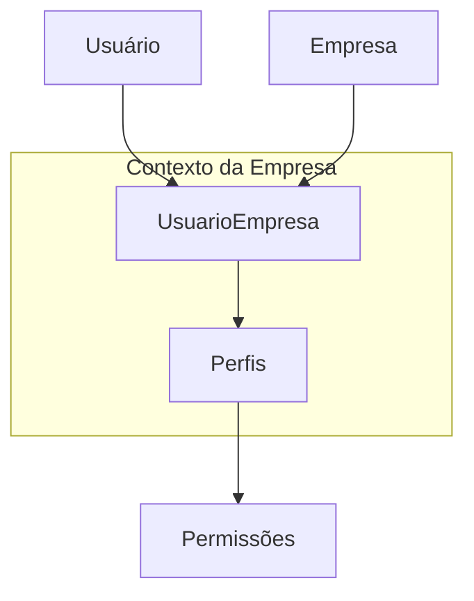

# API Padrão

## Descrição do Projeto

Este projeto é uma API RESTful robusta e escalável, desenvolvida com NestJS, utilizando Prisma como ORM e PostgreSQL como banco de dados. A arquitetura segue princípios de Clean Architecture, garantindo modularidade, testabilidade e fácil manutenção. A API inclui módulos essenciais para autenticação, gerenciamento de empresas, usuários, perfis e permissões, fornecendo uma base sólida para aplicações SaaS ou multi-tenant.

### Características Principais

*   **Autenticação Segura:** Implementação de autenticação JWT (JSON Web Tokens) para acesso seguro aos recursos da API.
*   **Gerenciamento de Empresas (Multi-tenancy):** Suporte a múltiplas empresas, onde usuários podem pertencer a várias empresas com perfis distintos em cada uma.
*   **Autorização Contextual:** Exigência do header `x-empresa-id` em requisições protegidas para validar permissões dentro do contexto de uma empresa específica.
*   **Gerenciamento de Usuários:** Funcionalidades completas para criação, leitura, atualização, **deleção lógica (soft delete) e restauração** de usuários.
*   **Perfis e Permissões por Contexto:** Sistema granular de perfis e permissões escopados por empresa. Cada empresa possui sua própria lista de perfis, permitindo que diferentes empresas usem os mesmos nomes de perfil com permissões distintas.

...

## Mudanças Recentes

*   **Arquitetura Multi-tenant:** Perfis de usuário agora são escopados por empresa. Cada empresa possui sua própria lista independente de perfis.
*   **Segurança Avançada:** Implementado `ClassSerializerInterceptor` global para ocultação automática de campos sensíveis (como senhas) via `@Exclude()`.
*   **Padronização de Erros:** Filtro global de exceções para respostas de erro consistentes em toda a API.
*   **Código Limpo:** Decoradores customizados `@UsuarioLogado()` e `@EmpresaId()` para simplificar controladores.
*   **Observabilidade:** Interceptor de logging automático para monitoramento de performance e status de requisições.
*   **Infraestrutura:** Migração para Jaeger v2 e otimização do coletor OpenTelemetry para suporte OTLP gRPC.
*   **Endpoints de Relacionamento:**
    *   `GET /empresas/:id/usuarios`: Lista usuários de uma empresa.
    *   `GET /usuarios/:id/empresas`: Lista empresas de um usuário.

## Arquitetura Multi-tenant

A aplicação utiliza um modelo multi-tenant onde os **Perfis e Permissões** de um usuário são definidos no contexto de uma **Empresa**.



### Como funciona a Autorização

Para acessar rotas protegidas que exigem permissões específicas (decorador `@TemPermissao`), o cliente deve enviar:
1.  O token JWT no header `Authorization: Bearer <token>`.
2.  O ID da empresa no header `x-empresa-id: <uuid>`.

O sistema validará se o usuário possui os perfis necessários para a ação especificamente na empresa informada.

## Arquitetura do Sistema

O projeto segue os princípios da **Clean Architecture**, organizado em camadas para garantir separação de preocupações e testabilidade:

1.  **Domain (Domínio):** Contém as entidades de negócio e interfaces de repositório. É o núcleo da aplicação.
2.  **Application (Aplicação):** Contém os casos de uso (Services), controladores e DTOs.
3.  **Infrastructure (Infraestrutura):** Implementações técnicas como repositórios Prisma, estratégias de autenticação e serviços externos.

## Tecnologias Utilizadas

*   **Framework:** NestJS (v11.1.6)
*   **Linguagem:** TypeScript (v5.6.2)
*   **ORM:** Prisma (v6.15.0)
*   **Banco de Dados:** PostgreSQL (via Docker)
*   **Autenticação:** JWT, Passport.js, bcrypt
*   **Logging:** nestjs-pino
*   **Configuração:** @nestjs/config, Joi
*   **Validação:** class-validator, class-transformer
*   **Observabilidade:** OpenTelemetry, Jaeger
*   **Testes:** Jest, Supertest

## Primeiros Passos

### Pré-requisitos

*   [Node.js](https://nodejs.org/en/) (v20+)
*   [Docker](https://www.docker.com/) e Docker Compose

### Instalação

1.  Clone o repositório:
    ```bash
    git clone <URL_DO_REPOSITORIO>
    cd api-padrao
    ```
2.  Instale as dependências:
    ```bash
    npm install
    ```

### Configuração e Execução

1.  Crie um arquivo `.env` (baseado no exemplo anterior).
2.  Inicie os serviços (Postgres, Jaeger):
    ```bash
    docker compose up --build -d
    ```
3.  Execute as migrações:
    ```bash
    npx prisma migrate dev
    ```
4.  Inicie a aplicação:
    ```bash
    npm run start:dev
    ```

## Estrutura do Projeto e Documentação

Cada módulo possui seu próprio arquivo de documentação detalhada:

- [**Autenticação**](src/auth/README.md)
- [**Empresas**](src/empresas/README.md)
- [**Usuários**](src/usuarios/README.md)
- [**Perfis**](src/perfis/README.md)
- [**Permissões**](src/permissoes/README.md)
- [**Módulo Compartilhado**](src/shared/README.md)
- [**Infraestrutura e Observabilidade**](src/shared/README_infra.md)

### Estrutura de Pastas
```
src/
├── auth/                   # Autenticação
├── empresas/               # Módulo de Empresas
├── usuarios/               # Módulo de Usuários
├── perfis/                 # Módulo de Perfis
├── permissoes/             # Módulo de Permissões
├── shared/                 # Compartilhados (Utils, DTOs)
└── prisma/                 # Prisma ORM
```

## Mudanças Recentes

*   **Empresas:** Adicionado módulo de empresas.
*   **Perfis de Usuário:** A relação entre Usuários e Perfis agora é mediada pela Empresa (`UsuarioEmpresa`). Um usuário não possui perfis globais, mas sim perfis específicos dentro de cada empresa que participa.

### Testes

*   **Unitários:** `npm run test`
*   **E2E:** `npm run test:e2e` (Requer `npm run test:migrate` antes)

## Licença

MIT