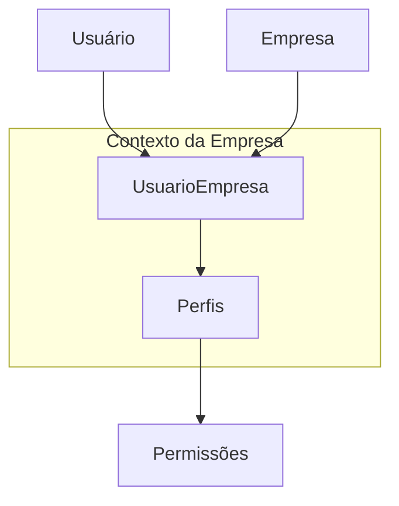

# API Padrão

## Descrição do Projeto

Este projeto é uma API RESTful robusta e escalável, desenvolvida com NestJS, utilizando Prisma como ORM e PostgreSQL como banco de dados. A arquitetura segue princípios de Clean Architecture, garantindo modularidade, testabilidade e fácil manutenção. A API inclui módulos essenciais para autenticação, gerenciamento de empresas, usuários, perfis e permissões, fornecendo uma base sólida para aplicações SaaS ou multi-tenant.

### Características Principais

*   **Autenticação Segura:** Implementação de autenticação JWT (JSON Web Tokens) para acesso seguro aos recursos da API.
*   **Gerenciamento de Empresas (Multi-tenancy):** Suporte a múltiplas empresas, onde usuários podem pertencer a várias empresas com perfis distintos em cada uma.
*   **Autorização Contextual:** Exigência do header `x-empresa-id` em requisições protegidas para validar permissões dentro do contexto de uma empresa específica.
*   **Gerenciamento de Usuários:** Funcionalidades completas para criação, leitura, atualização, **deleção lógica (soft delete) e restauração** de usuários.
*   **Perfis e Permissões por Contexto:** Sistema granular de perfis e permissões escopados por empresa. Cada empresa possui sua própria lista de perfis, permitindo que diferentes empresas usem os mesmos nomes de perfil com permissões distintas.

## Mudanças Recentes

*   **Arquitetura Multi-tenant:** Perfis de usuário agora são escopados por empresa. Cada empresa possui sua própria lista independente de perfis.
*   **Segurança Avançada:** Implementado `ClassSerializerInterceptor` global para ocultação automática de campos sensíveis (como senhas) via `@Exclude()`.
*   **Padronização de Erros:** Filtro global de exceções para respostas de erro consistentes em toda a API.
*   **Código Limpo:** Decoradores customizados `@UsuarioLogado()` e `@EmpresaId()` para simplificar controladores.
*   **Observabilidade:** Interceptor de logging automático para monitoramento de performance e status de requisições.
*   **Infraestrutura:** Migração para Jaeger v2 e otimização do coletor OpenTelemetry para suporte OTLP gRPC.
*   **Endpoints de Relacionamento:**
    *   `GET /empresas/:id/usuarios`: Lista usuários de uma empresa.
    *   `GET /usuarios/:id/empresas`: Lista empresas de um usuário.

---

## Documentação da API

### Documentação Interativa (Swagger)
A aplicação conta com uma documentação interativa via Swagger UI, onde é possível visualizar todos os endpoints, modelos de dados e testar as requisições diretamente pelo navegador.

**URL:** `http://localhost:3001/swagger`

### Autenticação
A maioria dos endpoints desta API requer autenticação via JWT (JSON Web Token).

#### 1. Obter Token
Para obter um token, você deve se autenticar com seu e-mail e senha.
**Endpoint:** `POST /auth/login`
**Público:** Sim

#### 2. Usar o Token
Para acessar endpoints protegidos, inclua o token no header `Authorization`:
```
Authorization: Bearer YOUR_TOKEN
```

#### 3. Contexto de Empresa
Muitos endpoints suportam ou requerem o header `x-empresa-id` para filtrar dados pelo contexto da empresa.
```
x-empresa-id: YOUR_EMPRESA_UUID
```

### Endpoints de Saúde (Health Check)
*   **Liveness Probe:** `GET /health/live` - Verifica se o processo está ativo.
*   **Readiness Probe:** `GET /health/ready` - Verifica dependências (DB, etc.).
*   **Network Probe:** `GET /health/network` - Verifica conectividade externa.

### Módulos e Recursos

#### Usuários
Gerenciamento de usuários do sistema.
*   `GET /usuarios`: Listar todos os usuários (paginado).
*   `GET /usuarios/:id`: Buscar um usuário por ID.
*   `POST /usuarios`: Criar um novo usuário.
*   `PATCH /usuarios/:id`: Atualizar um usuário (inclui soft delete/restore).
*   `GET /usuarios/:id/empresas`: Listar empresas vinculadas ao usuário.

#### Empresas
Gerenciamento de empresas (Multi-tenancy).
*   `GET /empresas`: Listar todas as empresas.
*   `GET /empresas/:id`: Buscar uma empresa pelo ID.
*   `POST /empresas`: Criar uma nova empresa.
*   `PATCH /empresas/:id`: Atualizar uma empresa.
*   `DELETE /empresas/:id`: Remover (soft delete) uma empresa.
*   `POST /empresas/:id/usuarios`: Vincular usuário à empresa com perfis.
*   `GET /empresas/:id/usuarios`: Listar usuários vinculados a uma empresa.

#### Perfis e Permissões
*   `GET /perfis`: Listar perfis vinculados à empresa.
*   `GET /perfis/:id`: Buscar perfil por ID.
*   `GET /permissoes`: Listar todas as permissões globais.

---

## Arquitetura Multi-tenant

A aplicação utiliza um modelo multi-tenant onde os **Perfis e Permissões** de um usuário são definidos no contexto de uma **Empresa**.



### Como funciona a Autorização

Para acessar rotas protegidas que exigem permissões específicas (decorador `@TemPermissao`), o cliente deve enviar:
1.  O token JWT no header `Authorization: Bearer <token>`.
2.  O ID da empresa no header `x-empresa-id: <uuid>`.

O sistema validará se o usuário possui os perfis necessários para a ação especificamente na empresa informada.

---

## Arquitetura do Sistema

O projeto segue os princípios da **Clean Architecture**, organizado em camadas para garantir separação de preocupações e testabilidade:

1.  **Domain (Domínio):** Contém as entidades de negócio e interfaces de repositório. É o núcleo da aplicação.
2.  **Application (Aplicação):** Contém os casos de uso (Services), controladores e DTOs.
3.  **Infrastructure (Infraestrutura):** Implementações técnicas como repositórios Prisma, estratégias de autenticação e serviços externos.

---

## Tecnologias Utilizadas

*   **Framework:** NestJS (v11.1.6)
*   **HTTP Server:** Fastify (via @nestjs/platform-fastify)
*   **ORM:** Prisma (v6.15.0)
*   **Banco de Dados:** PostgreSQL (via Docker)
*   **Autenticação:** JWT, Passport.js, bcrypt
*   **Observabilidade:** OpenTelemetry, Jaeger
*   **Testes:** Jest, Supertest

---

## Configuração e Execução

### Pré-requisitos
*   Node.js (v20+)
*   Docker e Docker Compose

### Instalação e Execução
1.  Clone o repositório e instale dependências: `npm install`
2.  Configure o arquivo `.env`.
3.  Inicie a infraestrutura: `docker compose up -d`
4.  Execute migrações: `npx prisma migrate dev`
5.  Inicie a API: `npm run start:dev`

### Testes
*   **Unitários:** `npm run test`
*   **E2E:** `npm run test:e2e` (Requer `npm run test:migrate` antes)

---

## Error Handling
A API utiliza um formato de erro padronizado:
```json
{
  "statusCode": 400,
  "timestamp": "2026-02-03T17:00:00.000Z",
  "path": "/usuarios",
  "message": "Mensagem de erro explicativa"
}
```

## Licença
MIT
