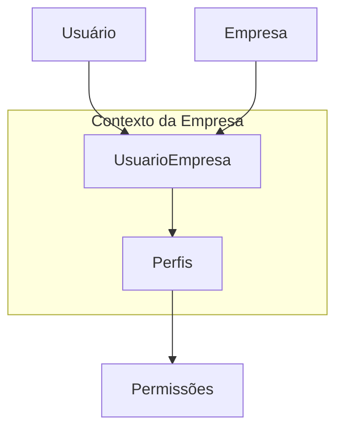

# API Padrão

API RESTful multi-tenant construída com **NestJS 11** + **Fastify**, **Prisma 6** + **PostgreSQL 16**, autenticação via **JWT**, com observabilidade via **OpenTelemetry/Jaeger**. Arquitetura em camadas (**Clean Architecture**) por módulo.

> **Toda a documentação técnica detalhada (comandos, workflow, módulo a módulo, env vars, convenções) está em [AGENTS.md](./AGENTS.md).** Este README é o entry point público: o que o projeto é, como rodar, e onde achar o resto.

## Características

- **Multi-tenancy com escopo por empresa**: usuários podem pertencer a várias empresas com perfis distintos em cada uma. Endpoints protegidos exigem os headers `Authorization: Bearer <jwt>` e `x-empresa-id: <uuid>`.
- **JWT + perfis/permissões**: perfis são escopados por empresa; permissões são globais. Use `@TemPermissao('READ_USUARIOS')` para gates de permissão.
- **Soft delete** automático em todas as entidades (via extensão do PrismaService).
- **Paginação padronizada** em todos os endpoints de listagem.
- **Observabilidade**: traces via OpenTelemetry, visualização no Jaeger (`http://localhost:16686`).
- **Rate limit** com 4 tiers configuráveis (default dominante: 100 req/min).

## Quickstart

```bash
# 1. Deps
npm install

# 2. Configure o ambiente (edite JWT_SECRET em .env)
cp .env.example .env

# 3. Suba a infra mínima (Postgres + Redis)
docker compose up -d postgres redis

# 4. Migre o schema
npx prisma migrate dev

# 5. Rode a API
npm run start:dev
```

- API: `http://localhost:3001`
- Swagger: `http://localhost:3001/swagger`
- Jaeger: `http://localhost:16686`

Para a stack completa (incluindo pgAdmin, Jaeger, OTEL Collector e a própria API containerizada), use `docker compose up -d`.

## Documentação da API (resumo)

### Autenticação

```bash
# Login (público)
curl -X POST http://localhost:3001/auth/login \
  -H 'Content-Type: application/json' \
  -d '{"email":"user@empresa.com","senha":"senha"}'

# Resposta: { "access_token": "...", "refresh_token": "..." }
```

Use o `access_token` em `Authorization: Bearer <token>` e o `x-empresa-id: <uuid>` nas chamadas protegidas.

### Endpoints de saúde

- `GET /health/live` — liveness
- `GET /health/ready` — readiness (DB + disco)
- `GET /health/network` — conectividade externa

### Recursos por módulo

- **Auth**: `POST /auth/login` — [src/auth/README.md](./src/auth/README.md).
- **Usuários**: CRUD + soft delete/restore + `GET /usuarios/:id/empresas` — [src/usuarios/README.md](./src/usuarios/README.md).
- **Empresas**: CRUD + soft delete + `POST/GET /empresas/:id/usuarios` — [src/empresas/README.md](./src/empresas/README.md).
- **Perfis**: CRUD escopado por empresa — [src/perfis/README.md](./src/perfis/README.md).
- **Permissões**: CRUD global — [src/permissoes/README.md](./src/permissoes/README.md).

## Arquitetura Multi-tenant


```mermaid
graph TD
    U[Usuário] --> UE[UsuarioEmpresa]
    E[Empresa] --> UE
    UE --> P[Perfis]
    P --> PE[Permissões]

    subgraph "Contexto da Empresa"
    UE
    P
    end
```

**Como funciona a autorização**: o cliente envia o JWT + o `x-empresa-id`. O `PermissaoGuard` valida se o usuário possui os perfis necessários **especificamente naquela empresa**. O mesmo nome de perfil pode existir em empresas diferentes com permissões diferentes.

## Erros

Todas as respostas de erro seguem o envelope:

```json
{
  "statusCode": 400,
  "timestamp": "2026-06-15T17:00:00.000Z",
  "path": "/usuarios",
  "message": "Mensagem de erro explicativa"
}
```

## Onde achar o resto

- Comandos de teste/lint/build, workflow DDD→BDD→SDD→ATDD→TDD, catálogo de módulos, env vars, entry points → **[AGENTS.md](./AGENTS.md)**
- Detalhes de Docker, OpenTelemetry/Jaeger, portas da stack → [src/shared/README_infra.md](./src/shared/README_infra.md)
- Regras de OpenSpec (RFC 2119, formato de spec) → [.openspec/AGENTS.md](./.openspec/AGENTS.md)
- Procedimentos passo a passo (SDD, alteração segura, E2E) → [.agent/workflows/](./.agent/workflows/)
- Contrato de um módulo específico → [src/<módulo>/README.md](./src/)
- Specs aprovadas/históricas → [.openspec/specs/](./.openspec/specs/)

## Testes

```bash
npm run test              # unitários
npm run test:e2e          # E2E (requer `npm run test:migrate` + infra)
npm run validate          # lint + build + test + e2e
npm run validate:quick    # lint + build + test
```

Mais detalhes em [AGENTS.md → Testing](./AGENTS.md#11-testing).

## Licença

MIT
